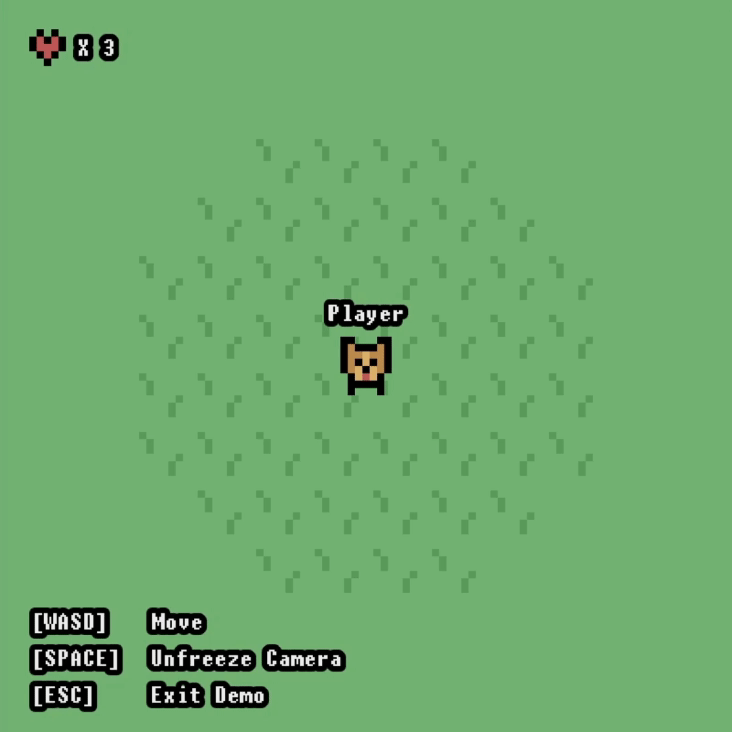

  

<h1>SFML Render System Demo</h1>

This project demonstrates a flexible and simple design pattern for [SFML](https://www.sfml-dev.org/) that enables the rendering of both _scaled_ sprites and _non-scaled_ text in the same drawing hierarchy.

The design pattern source code is [here](source/design-pattern/) and the rest of the demo source code is [here](source/demo/).

Windows x64 and x86 builds of the demo are [available](https://github.com/lukas-vaiciunas/sfml-render-system-demo/releases/tag/v1.0.0).

## Background

An out-of-the-box method to render [Drawables](https://www.sfml-dev.org/documentation/2.5.1/classsf_1_1Drawable.php) such as sprites and text in SFML is the use of [drawing hierarchies](https://en.sfml-dev.org/forums/index.php?topic=1686.0). This involves the usage of [RenderStates](https://www.sfml-dev.org/documentation/2.5.1/classsf_1_1RenderStates.php) that are passed down through the hierarchy; these RenderStates are applied to each rendered object. Generally, this means that transformations such as scaling, rotation, and translation are applied to the RenderStates at the top of the hierarchy and applied to each object in the hierarchy.

Prior to working on this project, I attempted to research existing solutions and was not able to find any.

## The Problem

In general, and especially for lower-resolution games, it is not advisable to scale text. As an alternative, it is recommended to use text character sizes that are appropriate for the player’s window resolution.

For example, instead of establishing a fixed character size of 16 and scaling up to 32, you should avoid scaling by establishing a fixed character size of 32 in the first place.

Therefore, since scaling is already applied to the RenderStates when text is reached in the drawing hierarchy, the text is scaled.

## The Solution

Creating custom Drawable classes solves this problem by applying transformations at render-time based on their type.

This solution uses SFML-styled functions and allows for hierarchical drawing.

## Demonstration

Two custom types of Drawables are defined in this demonstration: [WorldDrawable](source/design-pattern/WorldDrawable.h) and [InterfaceDrawable](source/design-pattern/InterfaceDrawable.h). These classes are inherited by custom Sprite and Text classes that are used in place of SFML’s standard classes, as well as classes that render them. The custom Sprite classes implement scaling while the custom Text classes do not.

The main difference between WorldDrawable and InterfaceDrawable are that WorldDrawables are translated by a camera position while InterfaceDrawables are not. Additionally, they are each scaled by their respective value.

### WorldDrawable
- Translated by a camera position.
- Scaled by a world scale.
  
### InterfaceDrawable
- Scaled by an interface scale.

### Controls
- WASD/Arrow Keys: Move
- Space: Freeze/Unfreeze Camera
- Escape: Exit Demo

## Notes

- The camera position is passed to WorldDrawables instead of the WorldCamera object itself to avoid repeated calls to WorldCamera::getPosition.
